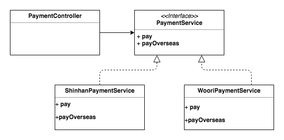
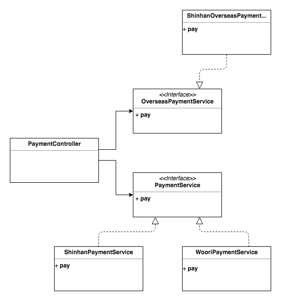

# 단일 책임의 원칙: Single Responsibility Principle

단일 책임의 원칙: Single Responsibility Principle 핵심 키워드는 다음과 같습니다. 해당 키워드를 기반으로 세부적으로 설명하겠습니다.

* 클래스는 단 한 개의 책임을 가져야 한다. -> 한 개의 책임? 클래스의 변경을 이르키는 사용자는 하나여야 한다.
* 클래스의 변경하는 이유는 단 한 개여야 한다.
* 누가 해당 메소드의 변경을 유발하는 사용자(Actor) 인가?


사실 단임 책임의 원칙이라는 것은 정말 이해하기 어렵습니다. 우선 명확한 책임을 도출하기까지 시간이 걸리기 때문에 처음부터 단일 책임을 지켜서 설계하는 것은 매우 힘들다고 생각합니다. 또 요구사항이 변경 시에 책임 또한 변경되게 됩니다. 그러니 지속해서 한 클래스가 한 책임만을 갖게 하기는 매우 어렵다고 생각합니다.

## 요구사항

* 카드 결제 시스템이 있다.
* 현재 국내 결제를 지원하는 카드는 신한, 우리 카드가 있다.
* 국내 결제 카드사들은 지속해서 추가된다.
* 앞으로 해외 결제 기능이 추가된다.
    * **신한 카드는 해외 결제가 가능하다.**
    * **우리 카드는 해외 결제가 불가능하다.**
    * 지속해서 카드사가 추가된다.


## 기존 국내 카드 결제의 SRP


```java
public interface CardPaymentService {
    void pay(CardPaymentDto.PaymentRequest req);
}

public class ShinhanCardPaymentService implements CardPaymentService {
    @Override
    public void pay(CardPaymentDto.PaymentRequest req) {
        // .. 신한 카드 국내 결제 로직..
        shinhanCardApi.pay(paymentRequest);
    }
}

public class WooriCardPaymentService implements CardPaymentService {
    @Override
    public void pay(CardPaymentDto.PaymentRequest req) {
        // .. 우리 카드 국내 결제 로직..
        wooriCardApi.pay(paymentRequest);
    }
}
```

* 클래스의 책임 : **해당 카드사의 결제 API를 호출하기 위한 적절한 값을 생성해서 호출하는 것**
* 변경의 근원 : 카드 결제를 하는 Actor
* Actor : 카드결제를 행하는 **행위자**

클래스의 변경은 단 한 개여야 한다. **라는 말은 그 클래스의 책임을 수행시키는 Actor의 변경 시에만 클래스의 변경이 가해져야 한다고 저는 해석 했습니다.**

만약 Actor가 결제 완료 시간 등 결제 정보를 받기를 원하게 된다면 `pay` 메서드의 리턴 타입이 변경이 발생합니다. 즉 카드 결제의 변경은 Actor의 변경에서부터 발생하게 됩니다. 

**여기서 Actor를 단순히 사용자로 바라보면 안 되고 Actor는 그 행위(국내 결제)를 하는 행위자로 봐야 한다. 그리고 단일 책임이라는 것은 단일 Actor를 뜻함**

## 추가될 해외 카드 결제의 SRP(미준수)

![]


```java
public interface CardPaymentService {
    void pay(CardPaymentDto.PaymentRequest req);
    void payOverseas(CardPaymentDto.PaymentRequest req);
}

public class ShinhanCardPaymentService implements CardPaymentService {
    @Override
    public void payOverseas(CardPaymentDto.PaymentRequest req) {
        // .. 신한 카드 해외 결제 로직..
        shinhanCardApi.pay(paymentRequest);
    }
}

public class WooriCardPaymentService implements CardPaymentService {
    @Override
    public void payOverseas(CardPaymentDto.PaymentRequest req) {
        // 우리 카드 결제는 해외 결제 기능이 없음...
    }
}
```
**신한 카드는 해외 결제를 할 수 있지만 우리 카드는 해외 결제 기능을 제공하고 있지 않습니다.** 각 구현 클래스들은 CardPaymentService 인터페이스를 구현하고 있으므로 payOverseas 기능이 추가되면 우리 카드 결제는 반드시 해당 메서드를 구현 해야 합니다. 

**해외 결제만 되고 국내 결제가 안 되는 카드 파트너가 추가되면 어떻게 될까요?** 그렇게 되면 위와 반대로 payOverseas 구현 메소드는 구현하고 pay는 구현하지 못하게 됩니다.

다시 SRP로 넘어가서 


### 책임이란 변화에 대한 것

국내 결제에서 해외 결제라는 책임이 하나 더 생긴 것입니다. 그렇게 두 개의 책임이 생겼고 그 결과 두 개의 Actor가 생긴 것이라고 생각합니다. (위에서 언급한 단일 책임 = 단일 Actor) 이로써 클래스의 책임을 나누는 작업이 필요해집니다.

**하지만 여기서 정말 중요한 것은 만약 우리카드가 해외 결제를 제공하고, 추가 파트너들도 해외 결제를 제공한다면 ?**

그렇다면 국내, 해외 결제를 할 수 있는 Actor는 한 개가 됩니다. Actor가 하나라는 것은 책임이 하나라는 뜻도 됩니다. 이런 경우 단일 책임의 원칙을 지켰다고 저는 개인적으로 생각합니다.

하지만 우리는 파트너사들이 어떤 기능을 제공할지, 또 어떤 파트너사들이 추가될지, 어떻게 변경될지 이런 부분들을 예측하기가 어려우므로 SRP를 지속적으로 준수하는 것은 정말 어렵다고 생각합니다.


## 추가될 해외 카드 결제의 SRP(준수)

!

카드 파트너사의 해외 결제 여부로 더이상 PaymentService에서 국내 결제와, 해외 결제를 처리를 못하게 되었습니다. 그렇다면 책임을 분리시키고 그것을 인터페이스로 바라보게 하여 앞으로 해외 결제 카드추가시 확장에 열려있게 할 수 있습니다.


## 정리
책임 = 하나의 액터(사용자/클라이언트)만이 클래스의 기능 변경에 대한 요구사항을 요청
우리에게는 크리스탈 볼이 없다. 미래를 예측하기 어렵다. 현재까지 수집된 요구사항으로 SRP를 준수하는 설계를
하더라도 얼마든지 깨질 수 있다. 소프트웨어 설계의 첫번째로 중요한 사항은 지속적으로 변화는 고객의 요구사항을 
적은 비용으로 수행할 수 있게 아키텍처를 설계 하는 것~~~
